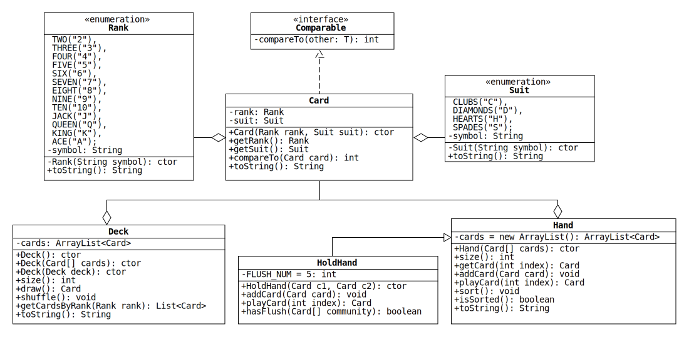

# Lab 8: Collections of Cards

In this lab, we will use the [Java collections framework](https://docs.oracle.com/en/java/javase/11/docs/api/java.base/java/util/doc-files/coll-overview.html) to write classes that represent collections of playing cards.
Additionally, we will use enumerated types to represent the ranks and suits of the cards.
Below is a UML diagram with the details:

## Rank and Suit Enums

Enumerated types can be used to represent the ranks and suits in a [standard 52-card deck](https://en.wikipedia.org/wiki/Standard_52-card_deck) of playing cards.
Take a look at [this short section](https://docs.oracle.com/javase/tutorial/java/javaOO/enum.html) of the Oracle Java tutorials before trying to implement them.

* `toString()`: Returns the string representation of the value of the enum, which is stored in the field `symbol`.

## Card

The Card class represents a card in a standard 52-card deck.
Each Card object contains a Rank and a Suit.

* `Card(Rank rank, Suit suit)`: Assign the given enum constants to the fields.
If either reference is null, throw a NullPointerException.

* `compareTo(Card card)`: Implement the method so that a list of Cards is sorted first by Suit and then by Rank.
(Hint: Java enums implement the [Comparable](https://docs.oracle.com/en/java/javase/11/docs/api/java.base/java/lang/Comparable.html) interface, and the compiler automatically generates their [compareTo](https://docs.oracle.com/en/java/javase/11/docs/api/java.base/java/lang/Enum.html#compareTo(E)) method.)

* `toString()`: Returns the concatenation of the string representations of the rank and suit.
For example, if the card is the nine of spades, the method returns "9 of S".

## Deck

The Deck class represents a deck of standard playing cards.
Deck objects contain a private ArrayList that stores Card objects.

* `Deck()`: Initialize the List so that it contains all 52 unique Cards in sorted order.
(Hint: Use the enum values method, which is automatically added to Rank and Suit by the compiler.)

* `Deck(Card[] cards)`: Creates a partial deck from the cards in the given array.

* `Deck(Deck deck)`: Creates a copy of the given deck.
(This is known as a "copy constructor.")
The new deck has its own copy of the List `cards`.

* `draw()`: Removes and returns the first card in `cards`.

* `shuffle()`: Randomizes the order of the cards in `cards`.
(Hint: use a method of the Collections class.)

* `size()`: Return the number of Cards in the List.

* `toString()`: Return the string representation of the List.

## Hand

The Hand class represents a player's cards in a generic card game.
Hand objects contain a private [ArrayList](https://docs.oracle.com/en/java/javase/11/docs/api/java.base/java/util/ArrayList.html) that stores Card objects.
An ArrayList is used because the methods of Hand require [random access](https://en.wikipedia.org/wiki/Random_access) to cards in the list.

* `Hand(Card[] cards)`: Creates a hand from the cards in the given array.

* `playCard(int index)`: Removes and returns the card with the given index in `cards`.

* `isSorted()`: Returns true if the elements of `cards` are in sorted order.
Otherwise, it returns false.

* `sort()`: Sorts `cards` into ascending order.
(Hint: use a method of the Collections class.)

The methods `size`, `getCard`, `addCard`, and `toString` simply call the corresponding methods of the ArrayList `cards`.

## HoldHand

HoldHand represents a hand of cards in a game of [Texas hold 'em](https://en.wikipedia.org/wiki/Texas_hold_%27em).

* `hasFlush(Card[] community)`: Returns true if 5 or more cards in the hand and the given array have the same suit.
Otherwise, it returns false.

  Hint: create a HashMap with the number of cards in each suit.

* `addCard(Card card)`: Cards cannot be added to a Texas Hold 'em hand.
Override this method so that it does nothing.

* `playCard(int index)`: Cards cannot be removed from a Texas Hold 'em hand.
Override this method so that it always returns null.
